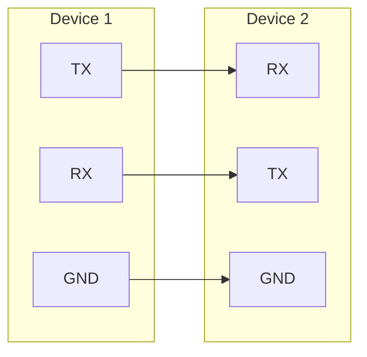
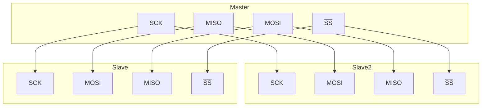
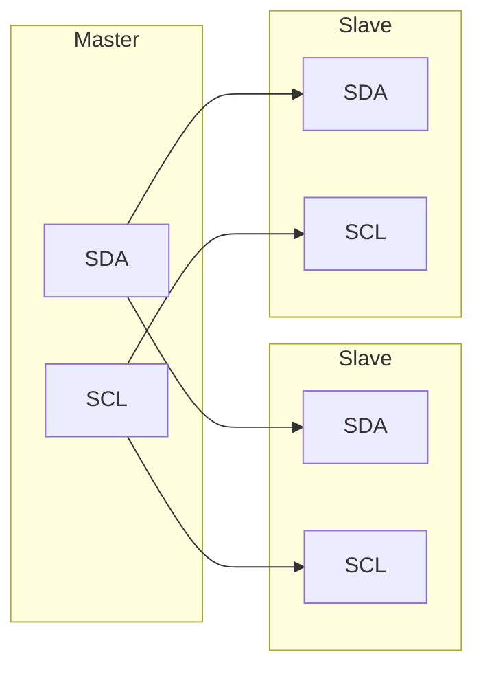

---

layout: post

title: 硬件通信方式

date: 2024-10-24

category: [Other]

mermaid: true

---
* TOC
{:toc}
---

# UART

**通用异步接收器 / 发送器**，通常称为 **UART**，是一种广泛应用于嵌入式领域的**串行**、**异步、全双工通信协议。**

UART 通道有两条数据线。每个设备上都有一个 RX 引脚和一个 TX 引脚（RX 用于接收，TX 用于发送）。

每个设备的 RX 引脚都连接到另一个设备的 TX 引脚。

请注意，没有共享时钟线！这是通用异步接收方发送方的 “异步” 方面。`同步加了时钟线，称为USART。`

UART 作为一种异步串行通信协议，其工作原理是逐位传输传输数据的每个二进制位。

- 1、串行通信是指利用一根传输线逐位依次传输数据。
- 2、异步通信以一个字符为传输单位。通信中两个字符之间的时间间隔不固定，但同一字符中两个相邻位之间的时间间隔是固定的。一般来说，两个 UART 设备之间的通信不需要时钟线。此时，需要在两个 UART 设备上指定相同的传输速率，以及空闲位、起始位、奇偶校验位和结束位，即遵循相同的协议。
- 3、全双公，代表着可以双方可以同时发送、接收数据。 4、数据传输速率以波特率表示，即每秒传输的位数。例如，如果数据传输速率为 120 个字符 / 秒，每个字符为 10 位（1 个起始位、7 个数据位、1 个校验位、1 个停止位），则其传输的波特率为 10×120 = 1200 个字符 / 秒 = 1200 波特率。

# SPI

**SPI 是英语 Serial Peripheral interface 的缩写，顾名思义就是串行外围设备接口。**

SPI，是一**种高速的，全双工，同步**的通信总线，并且在芯片的管脚上只占用四根线。

## SPI 分为主、从两种模式

一个 SPI 通讯系统需要包含一个（且只能是一个）主设备，一个或多个从设备。提供时钟的为主设备（Master），接收时钟的设备为从设备（Slave）

SPI接口读写操作，都是由主设备发起。当存在多个从设备时，通过各自的片选信号进行管理。

## SPI数据发送接收

SPI 主机和从机都有一个串行移位寄存器，主机通过向它的 SPI 串行寄存器写入一个字节来发起一次传输。

- 1、首先拉低对应 SS 信号线，表示与该设备进行通信
- 2、主机通过发送 SCLK 时钟信号，来告诉从机写数据或者读数据`这里要注意，SCLK时钟信号可能是低电平有效，也可能是高电平有效，因为SPI有四种模式，这里不展开，只要知道设备必须相同模式才能工作。`
- 3、主机 (Master) 将要发送的数据写到发送数据缓存区 (Menory)，缓存区经过移位寄存器 (0~7)，串行移位寄存器通过 MOSI 信号线将字节一位一位的移出去传送给从机，，同时 MISO 接口接收到的数据经过移位寄存器一位一位的移到接收缓存区。
- 4、从机 (Slave) 也将自己的串行移位寄存器 (0~7) 中的内容通过 MISO 信号线返回给主机。同时通过 MOSI 信号线接收主机发送的数据，这样，两个移位寄存器中的内容就被交换。

**SPI 只有主模式和从模式之分，没有读和写的说法，外设的写操作和读操作是同步完成的。如果只进行写操作，主机只需忽略接收到的字节；反之，若主机要读取从机的一个字节，就必须发送一个空字节来引发从机的传输。也就是说，你发一个数据必然会收到一个数据；你要收一个数据必须也要先发一个数据。**

# I2C

I2C 总线是一种串行、***\*半双工\****的总线，主要用于近距离、低速的芯片之间的通信；I2C 总线有两根双向的信号线，一根数据线 SDA 用于收发数据，一根时钟线 SCL 用于通信双方时钟的同步。

I2C 总线是一种多主机总线，连接在 I2C 总线上的器件分为主机和从机。主机有权发起和结束一次通信，从机只能被动呼叫；当总线上有多个主机同时启用总线时，I2C 也具备冲突检测和仲裁的功能来防止错误产生；

每个连接到 I2C 总线上的器件都有一个唯一的地址（7bit），`且每个器件都可以作为主机也可以作为从机（但同一时刻只能有一个主机）`，总线上的器件增加和删除不影响其他器件正常工作；

I2C 总线在通信时总线上发送数据的器件为发送器，接收数据的器件为接收器。

# CAN

Controller Area Network（控制器局域网）;

使用 CAN-H 和 CAN-L 两条线，抗电磁干扰能力强，传输距离可达 10km（低速）。

# USB

分为24P和16P（引脚数），主要区别就是支不支持USB3.0高速协议。有些只能充电，有些能传数据。现在USB魔改的太杂了。

# DMA

一般数据通过CPU到内存或者外设需要一定时间，在这个时间里CPU进程卡住无法做别的事情，DMA就是帮助CPU运送数据的一个工具。开启DMA后CPU可继续处理其他事情，由DMA将数据进行运送。

