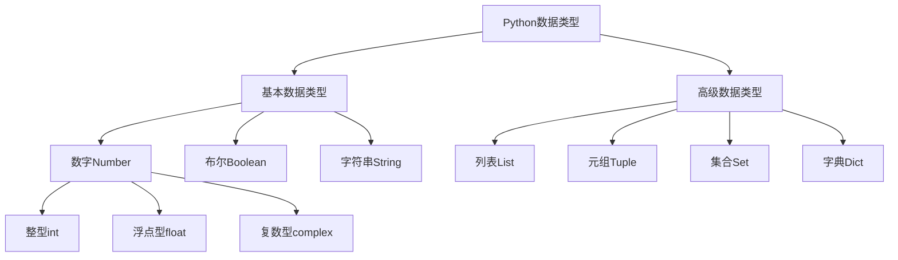

---

layout: post

title: Python教程(一)

date: 2024-11-27

category: [Python]

mermaid: true

---

# Python 基础数据类型与流程控制

## 一、Python 基础语法

### 1.1 缩进规则

- Python**以缩进来划分代码块**，缩进错误会直接导致程序报错
- 缩进规范：使用**2-4 个空格**，`Tab`等价于 4 个空格
- 同一代码块缩进长度必须统一，禁止空格与`Tab`混用

### 1.2 注释方式

- 单行注释：使用`#` 开头
- 多行注释：使用`''' 注释内容 '''` 或`""" 注释内容 """`

### 1.3 标识符规则

标识符用于命名变量、函数、类、模块等，规则如下：

1. 区分大小写（`sxt`与`SXT`为不同标识符）

2. 首字符必须是**字母 / 下划线**，后续可接字母、数字、下划线

3. 禁止使用 Python 保留字

4. 特殊命名规范：

   - 单下划线开头`_xxx`：表示内部属性，不建议外部访问
   - 双下划线开头`__xxx`：类私有成员
   - 双下划线首尾`__xxx__`：系统内置方法，避免自定义

   

### 1.4 保留字

Python 保留字均为小写，不可用作标识符：

| and      | def    | exec    | if     | not   | return |
| :------- | ------ | ------- | ------ | ----- | ------ |
| assert   | del    | finally | import | or    | try    |
| break    | elif   | for     | in     | pass  | while  |
| class    | else   | from    | is     | print | with   |
| continue | except | global  | lambda | raise | yield  |

### 1.5 输入与输出

#### 输出：print ()

- 基础打印：`print("Hello Python")`
- 多参数打印：`print("a", "b", "c")`
- 表达式打印：`print("300+200", 300+200)`
- 格式化输出（占位符）：

| 占位符 |     类型     |          示例          |
| :----: | :----------: | :--------------------: |
|   %d   |     整数     |   `print("%d" % 10)`   |
|   %f   |    浮点数    | `print("%.1f" % 3.5)`  |
|   %s   |    字符串    | `print("%s" % "张三")` |
|   %x   | 十六进制整数 |   `print("%x" % 20)`   |

#### 输入：input ()

- `input()`默认返回**字符串类型**，数值需强制转换
- 示例：

```
name = input("请输入姓名：")
age = int(input("请输入年龄："))  # 转整型
sal = float(input("请输入薪资："))  # 转浮点型
```

### 1.6 变量操作

1. 基础赋值：`变量名 = 变量值`（Python 变量必须赋值后使用）
2. 链式赋值：`a = b = c = 10`
3. 系列解包赋值：`a, b = 1, 2`
4. 变量交换：`a, b = b, a`
5. 删除变量：`del 变量名`

## 二、Python 数据类型

### 2.1 数据类型总览



### 2.2 基本数据类型

#### 数字类型（Number）

- 整型`int`：整数（无长短整型区分）
- 浮点型`float`：双精度浮点数
- 复数型`complex`：`a+bj`形式，示例：`z = 2+3j`

#### 布尔类型（Boolean）

- 取值：`True`/`False`，可等价为`1`/`0`

#### 字符串类型（String）

- 定义：单 / 双引号包裹字符序列，支持正向 / 反向索引
- 索引规则：正向从`0`开始，反向从`-1`开始
- 示例：

```
s = "abcdef12345"
s[0]  # 取第一个字符'a'
s[-1] # 取最后一个字符'5'
```

### 2.3 高级数据类型

#### 列表（List）

- 定义：`[元素1, 元素2, ...]`，元素可修改、类型可不同

- 常用操作：

  - 长度：`len(list)`
  - 添加：`list.append(obj)`
  - 删除：`list.remove(obj)`、`list.pop(index)`
  - 排序：`list.sort()`

  

#### 元组（Tuple）

- 定义：`(元素1, 元素2, ...)`，**元素不可修改**
- 切片规则：`sequence[start:stop:step]`（左闭右开）

#### 集合（Set）

- 定义：`{元素1, 元素2, ...}`，**无序、无重复元素**
- 常用操作：添加`add()`、删除`remove()`、交集 / 并集运算

#### 字典（Dict）

- 定义：`{key1:value1, key2:value2, ...}`，键唯一、值任意
- 键要求：不可变类型（字符串、数字）
- 常用操作：
  - 访问：`dict[key]`
  - 修改 / 添加：`dict[key] = value`
  - 删除：`del dict[key]`、`dict.clear()`

## 三、Python 流程控制

### 3.1 条件控制

#### if-elif-else 语句

```
if 条件1:
    代码块1
elif 条件2:
    代码块2
else:
    代码块3
```

match-case 语句（Python3.10+）
等价于 C 语言switch-case，用于多模式匹配

```
match 变量:
    case 模式1:
        代码块1
    case 模式2:
        代码块2
    case _:
        默认代码块
```

### 3.2 循环语句

#### while 循环

```
while 条件:
    循环体
```

#### for 循环

- 遍历可迭代对象：

```
sites = ["Baidu", "Google"]
for site in sites:
    print(site)
```

#### range () 函数

- 生成数字序列，格式：`range(start, stop, step)`
- 示例：`range(5)` → `0,1,2,3,4`

### 3.3 推导式

- 格式：`[表达式 for 变量 in 可迭代对象 if 条件]`
- 示例：生成 1-9 的平方列表

```
squares = [x**2 for x in range(10)]
```

## 四、异常处理

基础语法：`try...except...finally`

```
try:
    可能报错的代码
except 异常类型:
    异常处理代码
finally:
    无论是否报错都会执行的代码
```

