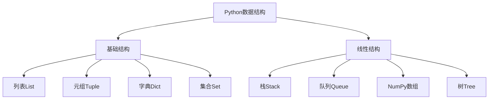

---

layout: post

title: Python教程(二)

date: 2024-11-30

category: [Python]

mermaid: true

---

# Python 正则表达式、函数、文件操作、数据结构与面向对象

## 一、正则表达式

正则表达式是**文本模式匹配工具**，用于字符串搜索、替换、验证，用单个字符串描述匹配规则。

### 1.1 限定符（Quantifier）

用于指定字符出现次数

| 表达式   | 含义                  |
| -------- | --------------------- |
| `a*`     | a 出现**0 次或多次**  |
| `a+`     | a 出现**1 次或多次**  |
| `a?`     | a 出现**0 次或 1 次** |
| `a{6}`   | a 出现**6 次**        |
| `a{2,6}` | a 出现**2-6 次**      |
| `a{2,}`  | a 出现**2 次及以上**  |

### 1.2 或运算符（OR）

- `(a|b)`：匹配 a 或 b
- `(ab)|(cd)`：匹配 ab 或 cd
- 括号表示**捕获组**，整体匹配

### 1.3 字符类

| 表达式        | 含义                  |
| ------------- | --------------------- |
| `[abc]`       | 匹配 a/b/c            |
| `[a-c]`       | 等价`[abc]`           |
| `[a-fA-F0-9]` | 匹配大小写字母 + 数字 |
| `[^0-9]`      | 匹配**非数字**字符    |

1.4 元字符

| 元字符 | 含义                             |
| ------ | -------------------------------- |
| `\d`   | 数字字符                         |
| `\D`   | 非数字字符                       |
| `\w`   | 单词字符（字母 / 数字 / 下划线） |
| `\W`   | 非单词字符                       |
| `\s`   | 空白符（换行 / Tab）             |
| `\S`   | 非空白符                         |
| `.`    | 任意字符（换行除外）             |
| `\b`   | 字符边界（全字匹配）             |
| `^`    | 行首                             |
| `$`    | 行尾                             |

### 1.5 贪婪 / 懒惰匹配

- **贪婪匹配**：`<.+>`，尽可能多匹配字符
- **懒惰匹配**：`<.+?>`，尽可能少匹配字符

## 二、函数

### 2.1 定义与调用

用`def`关键字定义函数，`return`返回值

```
# 定义
def max(a, b):
    return a if a > b else b
# 调用
print(max(3, 5))
```

### 2.2 参数类型

- **默认参数**：参数设默认值，调用可省略

```
def printinfo(name, age=20):
    print(name, age)
printinfo("LIN")  # 省略age，用默认值20
```

- **关键字参数**：按参数名传参，顺序不限

```
printinfo(age=20, name="LIN")
```

### 2.3 不定长参数

- 以**元组**接收未命名参数

```
def printinfo(arg1, *vartuple):
    print(arg1, vartuple)
printinfo(70, 60, 50)  # 输出：70 (60,50)
```

- 以**字典**接收命名参数

```
def printinfo(arg1, **vardict):
    print(arg1, vardict)
printinfo(1, a=2, b=3)  # 输出：1 {'a':2,'b':3}
```

## 三、文件操作

### 3.1 open () 函数

```
open(file, mode='r', encoding='utf-8')
```

- `file`：文件路径（必填）
- `mode`：打开模式
- `encoding`：编码，常用`utf-8`

### 3.2 常用打开模式

| 模式 | 作用               |
| ---- | ------------------ |
| `r`  | 只读（默认）       |
| `w`  | 只写，覆盖原有内容 |
| `b`  | 二进制模式         |
| `+`  | 可读可写           |
| `rb` | 二进制只读         |
| `w+` | 读写，覆盖原有内容 |

### 3.3 文件常用方法

| 方法                | 功能             |
| ------------------- | ---------------- |
| `file.close()`      | 关闭文件         |
| `file.read()`       | 读取文件内容     |
| `file.readline()`   | 读取一行         |
| `file.write(str)`   | 写入字符串       |
| `file.seek(offset)` | 移动文件指针     |
| `file.tell()`       | 获取当前指针位置 |
| `file.clear()`      | 清空文件         |

## 四、数据结构



### 4.1 栈（Stack）

- 原则：**后进先出（LIFO）**
- 核心操作：
  - `push`：压入（`append()`）
  - `pop`：弹出（`pop()`）
  - `isEmpty`：判空

```
stack = []
stack.append(1)  # 入栈
stack.append(2)
stack.pop()      # 出栈，返回2
```

### 4.2 队列（Queue）

- 原则：**先进先出（FIFO）**
- 用`collections.deque`实现，两端操作高效

```
from collections import deque
queue = deque()
queue.append('a')  # 入队
queue.append('b')
queue.popleft()    # 出队，返回'a'
```

## 五、面向对象编程（OOP）

### 5.1 类与对象

- **类**：抽象模板，`class`定义
- **对象**：类的实例

```
class Employee:
    empCount = 0  # 类属性
```

### 5.2 构造函数

- `__init__()`：创建对象时自动执行，初始化属性
- `self`：代表当前实例

```
class Employee:
    def __init__(self, name, salary):
        self.name = name  # 实例属性
        self.salary = salary
# 创建对象
emp1 = Employee("Zara", 2000)
```

### 5.3 类属性与方法

- **类属性**：所有实例共享，`类名.属性`访问
- **私有成员**：双下划线开头`__xxx`，外部不可访问
- **实例方法**：必须带`self`参数

### 5.4 内置类属性

| 属性        | 含义         |
| ----------- | ------------ |
| `__dict__`  | 类属性字典   |
| `__doc__`   | 类文档字符串 |
| `__name__`  | 类名         |
| `__bases__` | 父类元组     |

### 5.5 继承

- 子类继承父类，复用父类属性与方法
- 支持**多继承**

```
class Parent:
    def parentMethod(self):
        print("父类方法")

class Child(Parent):  # 继承Parent
    def childMethod(self):
        print("子类方法")

c = Child()
c.parentMethod()  # 调用父类方法
```

### 5.6 方法重写

子类重写父类同名方法，覆盖父类功能

```
class Parent:
    def myMethod(self):
        print("父类方法")

class Child(Parent):
    def myMethod(self):  # 重写
        print("子类方法")
```

### 5.7 运算符重载

通过重写内置方法，实现对象间运算

```
class Vector:
    def __init__(self, a, b):
        self.a = a
        self.b = b
    def __add__(self, other):  # 重载+
        return Vector(self.a + other.a, self.b + other.b)

v1 = Vector(2, 10)
v2 = Vector(5, -2)
print(v1 + v2)  # 输出Vector(7,8)
```

