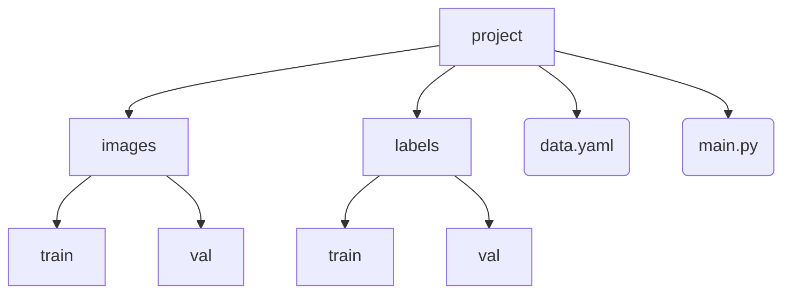

---

layout: post

title: Yolo训练

date: 2025-04-28

category: [AI,Python]

mermaid: true

---

# 工程结构



train是用来训练的，val是用来检测训练成果的

## data.yaml文件内容

```
path: C:\Users\1\Desktop\hokai_V1.0.0.202250115.base\project      #项目路径
train: images/train
val: images/val
nc: 26
names: ['遗器_挑战','指南_生存索引','指南_每日实训','游戏界面','ESC','委托','委托_一键领取','委托_再次派遣','委托_派遣中','指南','每日实训_领取','每日实训_礼物领取','点击空白处关闭','生存索引_侵蚀隧洞','生存索引_侵蚀隧洞_选中','指南_每日实训_选中','指南_生存索引_选中','遗器_迷识之径','遗器_支援','遗器_开始挑战','支援_选人_饮月','支援_选人_饮月_选中','支援_入队','遗器_挑战_再来一次','遗器_挑战_推出关卡','指南_每日实训_满活跃'] #所有标签
```

## main.py文件内容

```
from ultralytics import YOLO

mode = YOLO('yolov8n.pt')

mode.train(
    data ='data.yaml',
    epochs=500,   #训练次数
    imgsz=640,	#图片尺寸
    batch=30,	#同时处理多少文件
    # device='cpu'	#训练设备选择cpu还是gpu
    device= 0
)
```

# 框图

用框图工具，一点一点给我们要识别的图像打上标签