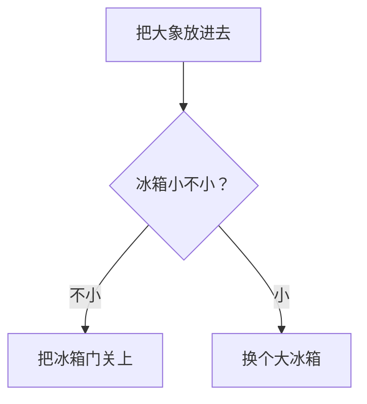

---

layout: post

title: 欢迎来到我的博客 

date: 2026-04-02

category: AI 

image: /Blog/post-image/image-20260404034104191.png

mermaid: true
---

###  这是测试文件

```mermaid
graph TB
    A[把大象放进去] --> B{"冰箱小不小？"}
    B -->|不小| C[把冰箱门关上]
    B -->|小| D[换个大冰箱]
```

