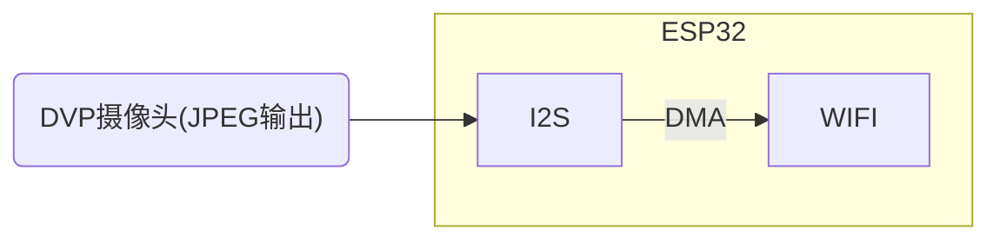
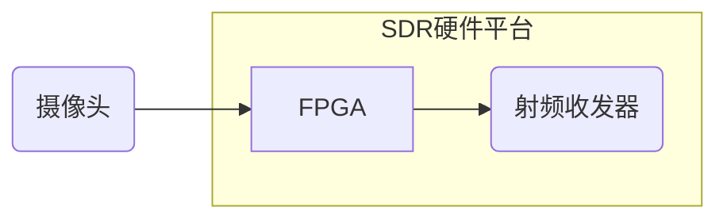

---

layout: post

title: 模拟图传与数字图传

date: 2026-04-02

category: [Other]

mermaid: true

---

# 数字图传

天空端

## 基于UDP的WIFI图传

最简单、基于WIFI连接

- 需要通信双方建立WIFI连接

- 一旦连接断开，会有明显卡顿

## 无连接的WIFI图传（树莓派图传）

将数据包通过注入的方式发出去，另一端网卡直接进行在monitor(监听)模式,筛选数据包然后组合解码

- #### 基本原理

  - 发送端直接将数据包通过inject方式从网卡发出
  - 接收端WIFI运行于monitor模式
  - 无需建立WIFI连接

这种图传也通常叫做树莓派图传，因为充分利用了树莓派的软件生态

- #### 树莓派图传

  - 摄像头 -> 树莓派编码（H264）-> 树莓派发送
  - 延迟：150ms以内
  - 瓶颈：linux的V4l2子系统会缓存3-4帧用于视频编码（H264帧间压缩）

- #### 缺点

  - 不是所有网卡驱动都带monitor模式，看是否支持kail

  - 体积太大/太贵（可以移植到国产Soc）

  - 编码延迟

    

https://befinitiv.wordpress.com/wifibroadcast-analog-like-transmission-of-live-video-data/ 

https://github.com/svpcom/wifibroadcast 

https://github.com/rodizio1/EZ-WifiBroadcast 

## ESP32 CAM fpv

最合适的？

400X296(20-50ms)

800X600(50-80ms)

也是类似于inject方式发包

- #### 缺点

  - 仅支持部分常见dvp摄像头
  - 功率较小
    - https://github.com/bisonscience/ESP32-M1-Reach-Out
    - 

https://github.com/jeanlemotan/esp32-cam-fpv 

## SDR图传

- #### 缺点

  - 难度较大
  - 贵

# 模拟图传

图传系统主要分为两个部分：接收端和发射端。发射端是安装在飞机上的摄像头与图传发射机，摄像头将拍摄到的画面转换为模拟信号传输给图传发射机，而发射机将摄像头的信号通过无线电发射出去。而接收端负责接收信号并且将呈现在屏幕上。

## 发射端

发射端关注发射功率。功率越大越好。常见的功率25mw，200mw，400mw，500mw，600mw，800mw和1w以上的大功率图传。

频段也有1.2G-5.8G，现在常用5.8G

[飞行器设计之5.8Ghz图传 - 立创开源硬件平台](https://oshwhub.com/clz1/5.8Ghztu-zhuan)

## 接收端

接收端主要有两种类别：一种是头戴的fpv眼镜或者是眼罩，还有一种是架在遥控器/三脚架上的屏幕（类似汽车中控台的那种）。

因为我们要改装，所以选用第二种

[sheaivey/rx5808-pro-diversity: DIY project to create your own 5.8ghz FPV diversity basestation - based off the rx5808 receiver module. Project includes basic Arduino Nano implementation to advanced custom PCB board and introduction to digital switches 4066 chip.](https://github.com/sheaivey/rx5808-pro-diversity?tab=readme-ov-file)

然后可以直接用CVBS输入的屏幕预览，或者OTG视频采集卡到手机上看，也可以接下来用CVBS->USB给树莓派或者PC电脑用做AI处理

[Ft-Available/RX5808-Div: 自制的RX5808接收机](https://github.com/Ft-Available/RX5808-Div)
