* TOC
{:toc}
---


# 数据结构

| 术语     | 生活比喻     | 技术定义                                   |
| :------- | :----------- | :----------------------------------------- |
| 数据     | 物品         | 信息的载体，是描述客观事物的符号           |
| 数据元素 | 单个物品     | 数据的基本单位                             |
| 数据结构 | 物品整理方式 | 数据元素之间存在的一种或多种特定关系的集合 |
| 算法     | 做事步骤     | 解决问题的明确指令，**有限时间内完成**     |

### 常见的数据结构

- **栈（Stack）：**栈是一种特殊的线性表，它只能在一个表的一个固定端进行数据结点的插入和删除操作。
- **队列（Queue）：**队列和栈类似，也是一种特殊的线性表。和栈不同的是，队列只允许在表的一端进行插入操作，而在另一端进行删除操作。
- **数组（Array）：**数组是一种聚合数据类型，它是将具有相同类型的若干变量有序地组织在一起的集合。
- **链表（Linked List）：**链表是一种数据元素按照链式存储结构进行存储的数据结构，这种存储结构具有在物理上存在非连续的特点。
- **树（Tree）：**树是典型的非线性结构，它是包括，2 个结点的有穷集合 K。
- **图（Graph）：**图是另一种非线性数据结构。在图结构中，数据结点一般称为顶点，而边是顶点的有序偶对。
- **堆（Heap）：**堆是一种特殊的树形数据结构，一般讨论的堆都是二叉堆。
- **散列表（Hash table）：**散列表源自于散列函数(Hash function)，其思想是如果在结构中存在关键字和T相等的记录，那么必定在F(T)的存储位置可以找到该记录，这样就可以不用进行比较操作而直接取得所查记录。

### 常用算法

数据结构研究的内容：就是如何按一定的逻辑结构，把数据组织起来，并选择适当的存储表示方法把逻辑结构组织好的数据存储到计算机的存储器里。算法研究的目的是为了更有效的处理数据，提高数据运算效率。数据的运算是定义在数据的逻辑结构上，但运算的具体实现要在存储结构上进行。一般有以下几种常用运算：

- **检索：**检索就是在数据结构里查找满足一定条件的节点。一般是给定一个某字段的值，找具有该字段值的节点。
- **插入：**往数据结构中增加新的节点。
- **删除：**把指定的结点从数据结构中去掉。
- **更新：**改变指定节点的一个或多个字段的值。
- **排序：**把节点按某种指定的顺序重新排列。例如递增或递减。

## 算法的核心特征

一个合格的算法必须具备以下五个基本特征，我们可以用做菜的类比来理解它们：

1. **有穷性**：算法必须在执行有限步之后结束。就像菜谱不能要求你无限搅拌直到宇宙尽头，它必须给出明确的停止条件。
2. **确定性**：算法的每一步都必须有确切的定义，没有歧义。例如，加少许盐是不确定的，而加 5 克盐是确定的。
3. **可行性**：算法中的每一个操作都必须是基本的、可以执行的。你不能在菜谱里写用意念把鸡蛋打散。
4. **输入**：一个算法有零个或多个输入。这些输入是算法处理的对象，就像菜谱需要的食材。
5. **输出**：一个算法有一个或多个输出。输出是与输入有特定关系的量，是算法执行的结果，就像最终做好的菜肴。

## 如何描述算法？

### 1. 自然语言描述

### 2. 流程图

### 3. 伪代码

### 4. 编程语言实现

## 算法分析：如何评价算法的好坏？

设计出能解决问题的算法只是第一步，我们还需要判断哪个算法更好。通常我们从两个维度来评估：

### 1. 时间复杂度

它衡量的是**算法运行所需的时间**如何随着**输入数据规模（n）** 的增长而增长。我们关注的不是具体的秒数，而是增长的趋势（称为 **渐进时间复杂度**）。

**常见时间复杂度对比：**

| 复杂度     | 名称       | 举例（n=数据量）       | 形象比喻                                             |
| :--------- | :--------- | :--------------------- | :--------------------------------------------------- |
| O(1)       | 常数阶     | 数组按索引取值         | **"开灯"**。无论房间多大，按开关的时间都一样。       |
| O(log n)   | 对数阶     | 二分查找               | **"翻字典"**。每次排除一半，查找速度极快。           |
| O(n)       | 线性阶     | 遍历数组               | **"数人数"**。一个人一个人地数，时间与总人数成正比。 |
| O(n log n) | 线性对数阶 | 快速排序、归并排序     | **"先分后治的排序"**。比 O(n²) 快很多。              |
| O(n²)      | 平方阶     | 简单选择排序、冒泡排序 | **"两两握手"**。每个人都要和其他所有人握手一次。     |
| O(2ⁿ)      | 指数阶     | 求解汉诺塔、暴力穷举   | **"细胞分裂"**。增长非常恐怖，稍大的 n 就无法承受。  |

**如何分析？** 关注循环和递归。

- 单层循环：通常是 O(n)。
- 嵌套循环：通常是 O(n²)（如果两层都与 n 相关）。
- 二分策略：通常是 O(log n)。

### 2. 空间复杂度

它衡量的是**算法运行所需的内存空间**如何随着**输入数据规模（n）** 的增长而增长。除了存储输入数据本身，还要考虑算法运行过程中额外申请的数组、变量等。

## 线性数据结构

**线性数据结构**就像是一排排队的人：

- 每个人（元素）都有明确的前后关系
- 除了第一个和最后一个，每个人都有一个前驱和一个后继
- 数据元素之间是一对一的线性关系

**常见线性数据结构：**

1. **数组**：像是一排编号的储物柜，每个柜子有固定位置
2. **链表**：像是一串手拉手的人，每个人只记住前后的人
3. **栈**：像是一叠盘子，只能从顶部取放
4. **队列**：像是排队买票，先来先服务

下图展示了线性数据结构的分类体系，每种结构都有其特定的应用场景和性能特点：

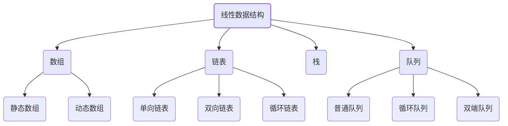

下图展示了栈的基本操作过程，栈遵循LIFO（后进先出 Last-In, First-Out）原则：

```mermaid
graph LR
    %% 定义节点
    Start("初始栈: []")
    Push1("push(1): [1]")
    Push2("push(2): [1, 2]")
    Push3("push(3): [1, 2, 3]")
    Peek("peek(): 3 (栈不变)")
    Pop1("pop(): [1, 2]")
    Pop2("pop(): [1]")
    End("pop(): []")

    %% 连接节点
    Start --> Push1 --> Push2 --> Push3 --> Peek --> Pop1 --> Pop2 --> End

    %% 颜色美化
    style Start fill:#E0F7FA,stroke:#81D4FA
    style Push1 fill:#EDE7F6,stroke:#B39DDB
    style Push2 fill:#EDE7F6,stroke:#B39DDB
    style Push3 fill:#EDE7F6,stroke:#B39DDB
    style Peek fill:#EDE7F6,stroke:#B39DDB
    style Pop1 fill:#EDE7F6,stroke:#B39DDB
    style Pop2 fill:#EDE7F6,stroke:#B39DDB
    style End fill:#FFEBEE,stroke:#EF9A9A
```

### 数组（Array）

#### 基本概念与特点

- **连续存储**：数组在内存中占据一块 **连续** 的空间，就像公寓楼里房间是紧挨着的。
- **固定大小**：数组在创建时就需要确定其容量（长度），之后通常不能改变，就像公寓楼盖好后房间数就固定了。
- **索引访问**：每个元素（房间）都有一个唯一的编号，称为 **索引**。在大多数编程语言中，索引从 `0` 开始。你可以通过索引直接、快速地访问任何一个元素，时间复杂度为 `O(1)`。

#### 优点与缺点

| 优点                                                   | 缺点                                                         |
| :----------------------------------------------------- | :----------------------------------------------------------- |
| **高速随机访问**：通过索引可在常数时间内访问任何元素。 | **大小固定**：静态数组一旦创建，容量难以改变。               |
| **内存效率高**：连续存储，无需额外空间存储元素间关系。 | **插入/删除成本高**：在中间插入或删除元素，需要移动大量后续元素以保持连续性。 |

#### 静态数组

| 特性     | 描述               | 时间复杂度 |
| :------- | :----------------- | :--------- |
| 访问元素 | 通过索引直接访问   | O(1)       |
| 插入元素 | 需要移动后续元素   | O(n)       |
| 删除元素 | 需要移动后续元素   | O(n)       |
| 空间分配 | 固定大小，预先分配 | O(1)       |

#### 动态数组

| 特性     | 描述               | 时间复杂度         |
| :------- | :----------------- | :----------------- |
| 访问元素 | 通过索引直接访问   | O(1)               |
| 插入元素 | 可能需要扩容和复制 | 平均O(1)，最坏O(n) |
| 删除元素 | 需要移动后续元素   | O(n)               |
| 空间分配 | 自动扩容           | O(n)（扩容时）     |

---

### 链表（Linked List）

#### 基本概念与类型

链表的每个 **节点** 至少包含两部分：

1. **数据域**：存储实际的数据值。
2. **指针域**：存储下一个节点在内存中的地址。

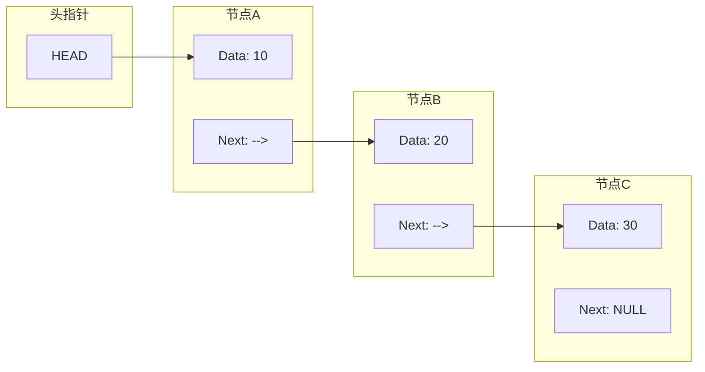

#### 链表主要类型：

- **单向链表**：节点只指向下一个节点。
- **双向链表**：节点同时指向前一个和后一个节点，可以双向遍历。
- **循环链表**：尾节点指向头节点，形成一个环。

#### 优点与缺点

| 优点                                                         | 缺点                                                         |
| :----------------------------------------------------------- | :----------------------------------------------------------- |
| **动态大小**：无需预先分配固定空间，可以灵活地增长和缩小。   | **内存开销**：每个节点都需要额外空间存储指针。               |
| **高效插入/删除**：在已知节点位置时，只需修改指针，无需移动大量元素。 | **顺序访问**：无法像数组一样通过索引直接访问，必须从头开始遍历。 |
|                                                              | **缓存不友好**：节点在内存中分散存储，不利于CPU缓存预取。    |

#### 单向链表

| 操作     | 描述           | 时间复杂度 |
| :------- | :------------- | :--------- |
| 访问元素 | 需要从头遍历   | O(n)       |
| 头部插入 | 直接插入       | O(1)       |
| 尾部插入 | 需要遍历到尾部 | O(n)       |
| 中间插入 | 需要先找到位置 | O(n)       |
| 删除元素 | 需要先找到位置 | O(n)       |

#### 双向链表

| 操作     | 描述                     | 时间复杂度 |
| :------- | :----------------------- | :--------- |
| 访问元素 | 需要从头或尾遍历         | O(n)       |
| 头部插入 | 直接插入                 | O(1)       |
| 尾部插入 | 直接插入（如果有尾指针） | O(1)       |
| 中间插入 | 需要先找到位置           | O(n)       |
| 删除元素 | 需要先找到位置           | O(n)       |

---

### 栈（Stack）

#### 基本概念与操作（后进先出）

栈只允许在一端（称为 **栈顶**）进行插入（**入栈**）和删除（**出栈**）操作。另一端称为 **栈底**。

| 操作          | 描述           | 时间复杂度 |
| :------------ | :------------- | :--------- |
| push(入栈)    | 在栈顶添加元素 | O(1)       |
| pop(出栈)     | 移除栈顶元素   | O(1)       |
| peek(查看)    | 查看栈顶元素   | O(1)       |
| isEmpty(判空) | 检查栈是否为空 | O(1)       |

---

### 队列（Queue）

#### 基本概念与操作（先进先出）

队列允许在一端（称为 **队尾**）进行插入（**入队**）操作，在另一端（称为 **队头**）进行删除（**出队**）操作。

| 操作            | 描述             | 时间复杂度 |
| :-------------- | :--------------- | :--------- |
| enqueue(入队)   | 在队尾添加元素   | O(1)       |
| dequeue(出队)   | 移除队头元素     | O(1)       |
| front(查看队头) | 查看队头元素     | O(1)       |
| isEmpty(判空)   | 检查队列是否为空 | O(1)       |

---

## 总结与对比

我们已经学习了四种基础的线性数据结构。下面这个表格帮助你快速回顾和对比它们的核心特性：

| 特性              | 数组                              | 链表                       | 栈                       | 队列                     |
| :---------------- | :-------------------------------- | :------------------------- | :----------------------- | :----------------------- |
| **存储方式**      | 连续内存                          | 分散内存，通过指针连接     | 基于数组或链表实现       | 基于数组或链表实现       |
| **访问方式**      | 随机访问（通过索引）              | 顺序访问（必须遍历）       | 仅限栈顶（LIFO）         | 仅限队头（FIFO）         |
| **插入/删除效率** | 尾部快，中间/头部慢（需移动元素） | 已知位置时快（只需改指针） | 栈顶操作，O(1)           | 队尾入队，队头出队，O(1) |
| **大小**          | 固定（静态数组）                  | 动态                       | 动态                     | 动态                     |
| **主要应用**      | 快速查找、固定集合                | 频繁插入删除、不确定大小   | 函数调用、回溯、括号匹配 | 任务调度、缓冲、BFS      |

### 如何选择？

- 需要 **快速随机访问** 和已知数据量时，选择 **数组**。
- 需要 **频繁在任意位置插入或删除** 元素，且数据量变化大时，选择 **链表**。
- 需要实现 **"撤销"** 功能或 **反向处理** 顺序时，考虑 **栈**。
- 需要按 **"先来后到"** 的顺序处理任务时，使用 **队列**。

## 哈希表

哈希表（Hash Table），也叫散列表，是一种极其高效的数据结构。

哈希表能在平均情况下，以接近 `O(1)` 的时间复杂度进行数据的插入、删除和查找，这比数组的遍历（`O(n)`）和二叉搜索树的搜索（`O(log n)`）要快得多。

### 核心组件

一个哈希表主要由以下三个核心部分组成：

1. **键（Key）**： 你要存储和查找数据时使用的标识符。比如，在电话簿中，人名就是键。
2. **值（Value）**： 与键相关联的实际数据。在电话簿中，电话号码就是值。
3. **哈希函数（Hash Function）**： 将键映射到数组索引的数学函数。它是哈希表的心脏。

### 哈希函数设计

#### 好的哈希函数特性

| 特性         | 描述                         | 重要性 |
| :----------- | :--------------------------- | :----- |
| **确定性**   | 相同输入总是产生相同输出     | ⭐⭐⭐⭐⭐  |
| **均匀分布** | 输出均匀分布在哈希表范围内   | ⭐⭐⭐⭐⭐  |
| **高效计算** | 计算过程简单快速             | ⭐⭐⭐⭐   |
| **雪崩效应** | 输入微小变化导致输出巨大变化 | ⭐⭐⭐    |

#### 常见哈希函数

| 类型           | 示例                                          | 适用场景     |
| :------------- | :-------------------------------------------- | :----------- |
| **除法取余法** | `hash = key % table_size`                     | 整数键       |
| **乘法取整法** | `hash = floor(key * A % 1 * table_size)`      | 浮点数键     |
| **数字分析法** | 分析数字的分布规律                            | 特定模式数据 |
| **平方取中法** | `hash = (key * key) // 10^(n/2) % table_size` | 数字键       |
| **字符串哈希** | 逐字符处理                                    | 字符串键     |

### 冲突解决方法(哈希碰撞)

#### 链地址法（Separate Chaining）

**原理**：就像在储物柜的同一个格子（桶）里挂了一个文件夹（链表），所有冲突的元素都存在这个文件夹里。

| 特性         | 描述                   | 时间复杂度        |
| :----------- | :--------------------- | :---------------- |
| **原理**     | 每个哈希桶维护一个链表 |                   |
| **插入**     | 在对应链表头部添加     | O(1)              |
| **查找**     | 在对应链表中搜索       | O(k)，k为链表长度 |
| **删除**     | 在对应链表中删除       | O(k)              |
| **空间开销** | 需要额外指针存储       | 较大              |

#### 开放定址法（Open Addressing）

**原理**：如果这个位置被人占了，就按某种规则找下一个空位。

| 类型         | 探测序列                               | 优点       | 缺点                 |
| :----------- | :------------------------------------- | :--------- | :------------------- |
| **线性探测** | `h, h+1, h+2, ...`                     | 简单易实现 | 容易聚集             |
| **二次探测** | `h, h+1², h+2², ...`                   | 减少聚集   | 可能无法探测所有位置 |
| **双重哈希** | `h, h+hash2(key), h+2*hash2(key), ...` | 分布均匀   | 计算复杂             |

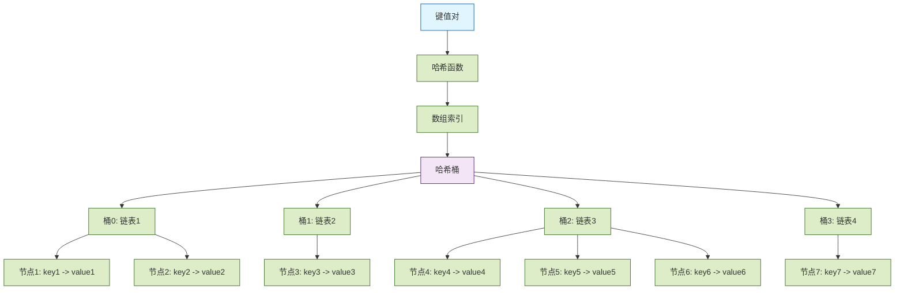

### 两种方法的对比

| 特性         | 链地址法                         | 开放地址法                                       |
| :----------- | :------------------------------- | :----------------------------------------------- |
| **实现难度** | 相对简单                         | 相对复杂，尤其是删除操作                         |
| **空间开销** | 需要额外空间存储指针（链表）     | 所有数据都在数组中，空间利用率可能更高           |
| **冲突影响** | 冲突只影响同一个桶（链表）的性能 | 冲突会影响后续插入的位置，可能导致"聚集"现象     |
| **扩容时机** | 当平均链表长度超过阈值时扩容     | 当负载因子（元素数/数组大小）超过阈值时扩容      |
| **适用场景** | 通用，更常见                     | 对缓存友好，适用于已知最大数据量或内存紧张的场景 |

### 哈希表的性能与负载因子

哈希表的效率高度依赖于一个关键指标：**负载因子**。

**负载因子 = 哈希表中已存储的元素数量 / 哈希表数组的总大小**

- **负载因子低**（如 0.5）： 意味着数组还有很多空位，冲突概率小，操作速度快。
- **负载因子高**（如 0.9）： 意味着数组快满了，冲突概率急剧增加，链表变长或探测距离变长，性能下降。

为了保持高性能，当负载因子超过某个阈值（例如 0.75）时，哈希表会进行**扩容**操作：

1. 创建一个新的、更大的数组（通常是原大小的两倍）。
2. 遍历旧哈希表中的所有键值对。
3. 根据新的数组大小，用哈希函数重新计算每个键的索引，并将其插入到新数组中。

这个过程称为 **Rehashing**，虽然耗时，但能显著降低负载因子，使哈希表恢复高效。

## 树形结构

树（Tree）是一种**非线性**的数据结构，它模拟了自然界中树的分支层次，与数组、链表这种一个接一个的线性结构不同，树中的数据元素（称为**节点**）之间存在明确的一对多的层次关系。

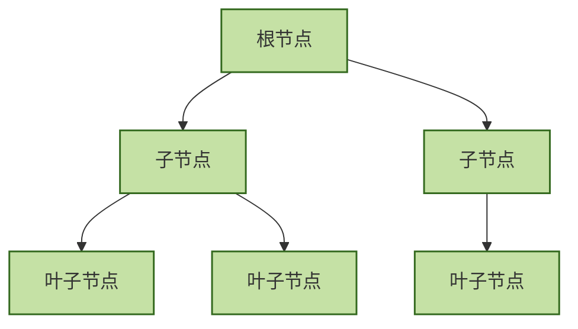

- **节点（Node）**：树中的每一个元素。它包含存储的数据和指向其子节点的链接。
- **根节点（Root）**：位于树顶端的节点，是整棵树的起点。一棵树有且仅有一个根节点。
- **父节点与子节点（Parent & Child）**：如果一个节点 A 连接到下方的节点 B，那么 A 是 B 的**父节点**，B 是 A 的**子节点**。一个父节点可以有多个子节点。
- **兄弟节点（Siblings）**：拥有同一个父节点的节点们互为兄弟节点。
- **叶子节点（Leaf）**：没有子节点的节点，也称为终端节点。
- **边（Edge）**：连接两个节点的线，表示它们之间的关系。
- **路径（Path）**：从根节点到某个特定节点所经过的节点序列。
- **高度（Height）**：从某个节点到其最远叶子节点的最长路径上的**边数**。树的高度即根节点的高度。
- **深度（Depth）**：从根节点到某个节点的路径上的**边数**。根节点的深度为 0。
- **层（Level）**：深度相同的所有节点属于同一层。根节点在第 0 层。

### 树的基本性质

1. **唯一路径**：树中任意两个节点之间有且仅有一条路径。
2. **N 个节点，N-1 条边**：一棵具有 N 个节点的树，总共有 N-1 条边。
3. **无环**：树中不存在环（即从某个节点出发，沿着边最终又能回到该节点）。

### 为什么需要树？—— 树的优势与应用

你可能会问，有了数组和链表，为什么还需要树？答案在于效率。

- **数组**：查找快（通过索引），但插入和删除慢（需要移动大量元素）。
- **链表**：插入和删除快，但查找慢（需要从头遍历）。
- **树（特别是二叉搜索树）**：在保持数据有序的同时，能提供比链表快得多的搜索速度，以及比数组更高效的插入/删除操作。

### 二叉树：树家族中最重要的一员

二叉树（Binary Tree）是每个节点最多有两个子节点的树，这两个子节点通常被称为**左子节点**和**右子节点**，它是许多强大树结构（如二叉搜索树、堆、AVL 树）的基础。

基本结构如下：

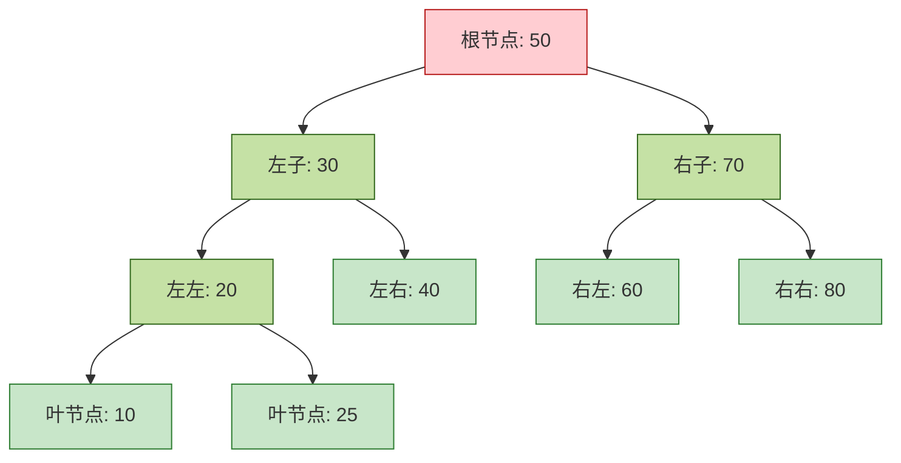

### 二叉树类型

| 类型           | 特点                     | 时间复杂度   | 应用场景   |
| :------------- | :----------------------- | :----------- | :--------- |
| **普通二叉树** | 每个节点最多2个子节点    | O(n)         | 表达式树   |
| **满二叉树**   | 每个节点都有0或2个子节点 | O(n)         | 霍夫曼编码 |
| **完全二叉树** | 除最后一层外都是满的     | O(n)         | 堆实现     |
| **二叉搜索树** | 左<根<右                 | 平均O(log n) | 搜索、排序 |
| **平衡二叉树** | 左右子树高度差≤1         | O(log n)     | 数据库索引 |
| **红黑树**     | 带颜色的平衡树           | O(log n)     | Linux内核  |

### 二叉树的遍历

遍历是指按照某种规则访问树中的每一个节点，且每个节点只访问一次。这是树相关算法的基础。主要有四种方式：

1. **前序遍历（Pre-order）**：**根 -> 左 -> 右**
   - 先访问根节点，然后递归地前序遍历左子树，最后递归地前序遍历右子树。
   - **应用**：复制一棵树、获取前缀表达式。
2. **中序遍历（In-order）**：**左 -> 根 -> 右**
   - 先递归地中序遍历左子树，然后访问根节点，最后递归地中序遍历右子树。
   - **应用**：在**二叉搜索树**中，中序遍历会以**升序**输出所有值。
3. **后序遍历（Post-order）**：**左 -> 右 -> 根**
   - 先递归地后序遍历左子树，然后递归地后序遍历右子树，最后访问根节点。
   - **应用**：删除一棵树、计算目录大小。
4. **层序遍历（Level-order）**：**按层，从左到右**
   - 从根节点开始，一层一层地访问节点。
   - **应用**：按层级处理数据（如打印组织结构图）。**通常使用队列（Queue）辅助实现**。

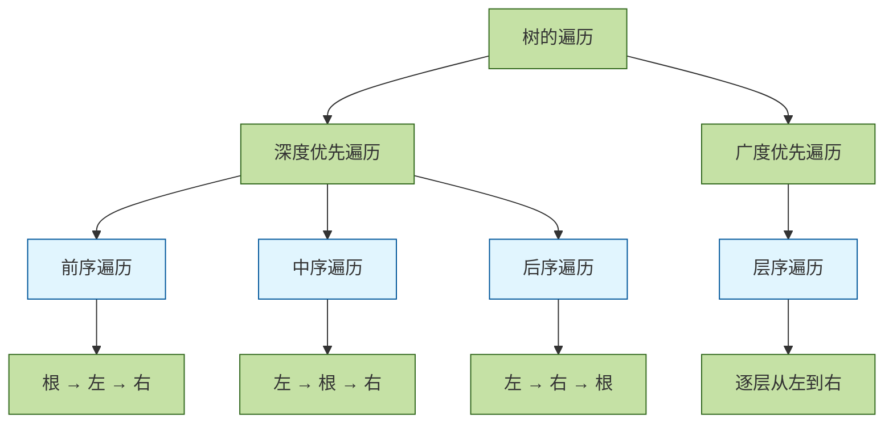

**示例**：对于下图二叉树，遍历结果如下：

```
        1
       / \
      2   3
     / \   \
    4   5   6
```

- **前序**：1, 2, 4, 5, 3, 6
- **中序**：4, 2, 5, 1, 3, 6
- **后序**：4, 5, 2, 6, 3, 1
- **层序**：1, 2, 3, 4, 5, 6


### 二分搜索树

#### 一、概念及其介绍

二分搜索树（英语：Binary Search Tree），也称为 二叉查找树 、二叉搜索树 、有序二叉树或排序二叉树。满足以下几个条件：

- 若它的左子树不为空，左子树上所有节点的值都小于它的根节点。
- 若它的右子树不为空，右子树上所有的节点的值都大于它的根节点。

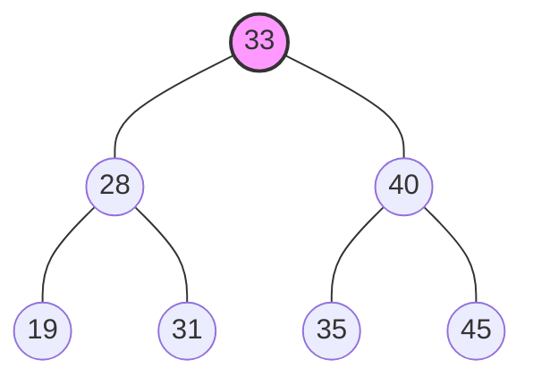

#### 二、适用说明

二分搜索树有着高效的插入、删除、查询操作。

平均时间的时间复杂度为 **O(log n)**，最差情况为 **O(n)**。二分搜索树与堆不同，不一定是完全二叉树，底层不容易直接用数组表示故采用链表来实现二分搜索树。

### 哈夫曼树

---

#### 香农范诺编码

找到最佳分割点(接近每组概率平均)，递归分割直至每个符号每组唯一


**最小概率的编码最长，最大概率的编码最短**

香农范诺编码是按照概率之和从中间分割，这个过程并不能保证每次分割都是最优，这个选择可能并不是全局最优解

哈夫曼编码能够保证最优解的原因，是其构建编码数的贪婪算法确保了最佳编码数是最优解的

#### 哈夫曼编码

排序符号概率，选择两个最低概率的符号组成两个节点，并将概率之和加入到未编码符号概率排序中，递归调用


---

### AVL树

AVL树又叫平衡二叉树

所有节点的**左子树高度-右子树高度**(平衡因子)的绝对值<=1;

AVL通过**左右旋转节点**调整树高以达到平衡


- 插入结点后如果导致多个祖先结点失衡
  只需调整距离插入结点最近的失衡结点，其他失衡结点会自然平衡

- 删除结点后需要依次对每个祖先检查并调整

### 红黑树

也是一种平衡二叉树，只不过与AVL树的平衡策略不一样，通过赋予节点颜色来进行平衡

需要遵循的规则：根叶黑(根节点，和叶子节点(指的是空节点)都需要是黑色)；左根右(二叉搜索树基本)；不红红（不存在两个连续红色节点）；黑路同（任意节点到叶子节点的路径上黑色节点数量相同，这也导致树的最长路径不超过最短路径两倍）

插入节点遵循AVL树旋转规则，但是旋转后要变色；

- 旋转前先判断叔父节点的颜色，如果是红色需要先将叔父，父，爷爷节点颜色变色（红变黑黑变红），

- 将根节点颜色变为黑色
- AVL旋转
- 将旋转点和旋转中心(比如说RR型左旋，爷爷节点就是旋转点，父节点就是旋转中心节点；LR型先左再右，先将父节点和当前节点左旋然后再将爷爷节点右旋，这里只看最后操作，所以爷爷节点就是旋转点，当前节点就是旋转中心节点)节点颜色变色

删除节点太复杂


- 当只有左孩子或者右孩子的情况下，直接删除节点然后孩子节点代替并且颜色变黑

- 当左右都有的时候，找前驱节点或者后继节点代替，然后再删除前驱或者后继(这里注意可能会递归)

- 当删除节点没有孩子的情况，如果删除的是红色就直接删除；
- 如果是黑色就需要看兄弟节点，兄弟节点如果是黑色，把当前节点换成双黑（假设存在的黑色节点，也就是黑色空节点套个黑色环），继续判断兄弟节点的孩子，
  - 如果有红色孩子，先变色(先判断红孩子这条路是什么类型
    - 如果LL，RR红色孩子颜色变为兄弟颜色，兄弟颜色变为父颜色，父颜色变黑，然后再旋转，与插入不同之后不再变色；
    - 如果是LR，RL则红孩子节点颜色变成父节点颜色，父节点颜色变黑，再旋转)；
  - 如果兄弟节点的孩子都是黑色，兄弟节点颜色变红，双黑中的黑色环上移，遇到红色节点将该红色节点颜色变成黑色
- 如果兄弟节点是红色，兄弟节点和父节点变色，父节点朝向双黑节点旋转，然后递归到判断兄弟节点是黑色这一步

### B树

也称多叉平衡搜索树；为了减少搜索次数(与树高正相关)

与AVL和红黑不同的是他一个节点并不是只有一个元素，也不一定只有两个分支

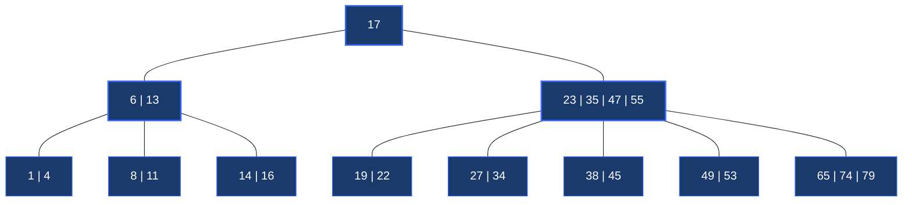

这个树最下层还有一堆空节点，将这些空节点成为外部节点(失败节点)（因为说法不一，本文将内部节点的最后一层叫做叶子节点），上面那些有数据的就是内部节点

B树所有结点的关键字都有直接指向对应记录的指针		

B树规则：

- 平衡：所有的叶子节点都在同一层
- 有序：节点内有序，任意元素的左子树都小于它，右子树都大于它
- 多路：对于m阶B树的节点
  - 最多：m个分支，m-1个元素
  - 最少：根节点2个分支,1个元素；其他节点[m/2]个分支，[m/2]-1个元素

### B+树

被广泛用于数据库的索引

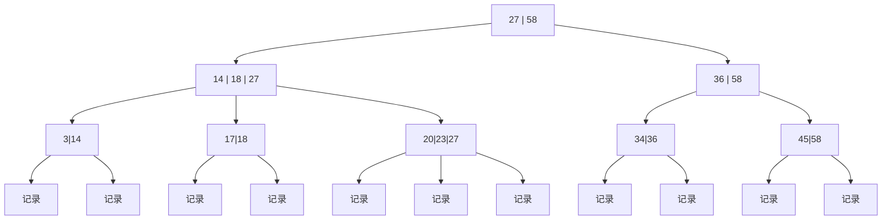

B+树叶结点包含全部关键字及指向相应记录的指针，非叶结点只作索引

B+树中m个分支有m个关键字

B+树兼顾

- 顺序查找(叶子节点可以形成一个链表，这里我没画，从HEAD指针按照顺序访问即可)

- 随机查找（和B树一样从根节点往下找）

- 范围查找（先随机查找然后再顺序查找）

## 图论结构

### 图的基本术语

| 术语               | 定义                 | 生活比喻           | 符号表示   |
| :----------------- | :------------------- | :----------------- | :--------- |
| **顶点（Vertex）** | 图中的基本单元       | 社交网络中的人     | V, u, v    |
| **边（Edge）**     | 连接两个顶点的线     | 两人之间的关系     | E, (u,v)   |
| **度（Degree）**   | 顶点连接的边数       | 一个人的好友数量   | deg(v)     |
| **路径（Path）**   | 顶点的序列           | 从A到B的路线       | v₁→v₂→…→vₙ |
| **环（Cycle）**    | 起点和终点相同的路径 | 从家出发最终回家   | v₁→v₂→…→v₁ |
| **连通图**         | 任意两点间都有路径   | 所有人都能互相联系 |            |
| **权重（Weight）** | 边的数值属性         | 两城市间的距离     | w(u,v)     |

### 图的分类

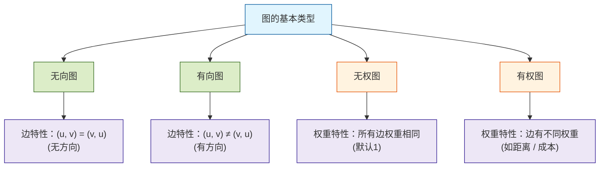

### 图的存储方式

如何在计算机中表示一个图？主要有两种主流方法。

#### 邻接矩阵

使用一个二维数组（矩阵）`matrix` 来表示图。`matrix[i][j]` 的值表示顶点 `i` 到顶点 `j` 的边的情况。

- 对于无向图，矩阵是对称的。
- 对于权重图，矩阵值存储权重（用特殊值如 `0` 或 `∞` 表示无边）。
- **优点**：检查任意两个顶点间是否有边非常快（`O(1)`）。
- **缺点**：占用空间大（`O(V^2)`），对于边数较少的"稀疏图"浪费空间。

#### 邻接表

为每个顶点维护一个列表（链表、数组等），记录与其直接相连的所有顶点（及权重）。

- **优点**：空间效率高（`O(V + E)`），特别适合稀疏图。能快速找到一个顶点的所有邻居。
- **缺点**：检查任意两个顶点间是否有边较慢（`O(degree(V))`）。

---

### 图的遍历算法

遍历是图算法的基础，意味着系统地访问图中的每一个顶点。

主要有两种策略：

#### 广度优先搜索

广度优先搜索（）像"水波扩散"一样，从起点开始，先访问所有直接邻居，再访问邻居的邻居，依此类推。它使用**队列**来实现。

**算法步骤**：

1. 将起点放入队列并标记为已访问。
2. 当队列不为空时： a. 取出队首顶点 `v`。 b. 访问 `v` 的所有未访问邻居，将它们放入队列并标记为已访问。
3. 重复步骤2。

#### 深度优先搜索

深度优先搜索（DFS）像"走迷宫"一样，选择一条路走到尽头，然后回溯，再走另一条路。它使用**栈**（或递归）来实现。

**递归算法步骤**：

1. 从顶点 `v` 开始，标记为已访问。
2. 对于 `v` 的每一个未访问邻居 `u`： a. 递归调用 `DFS(u)`。

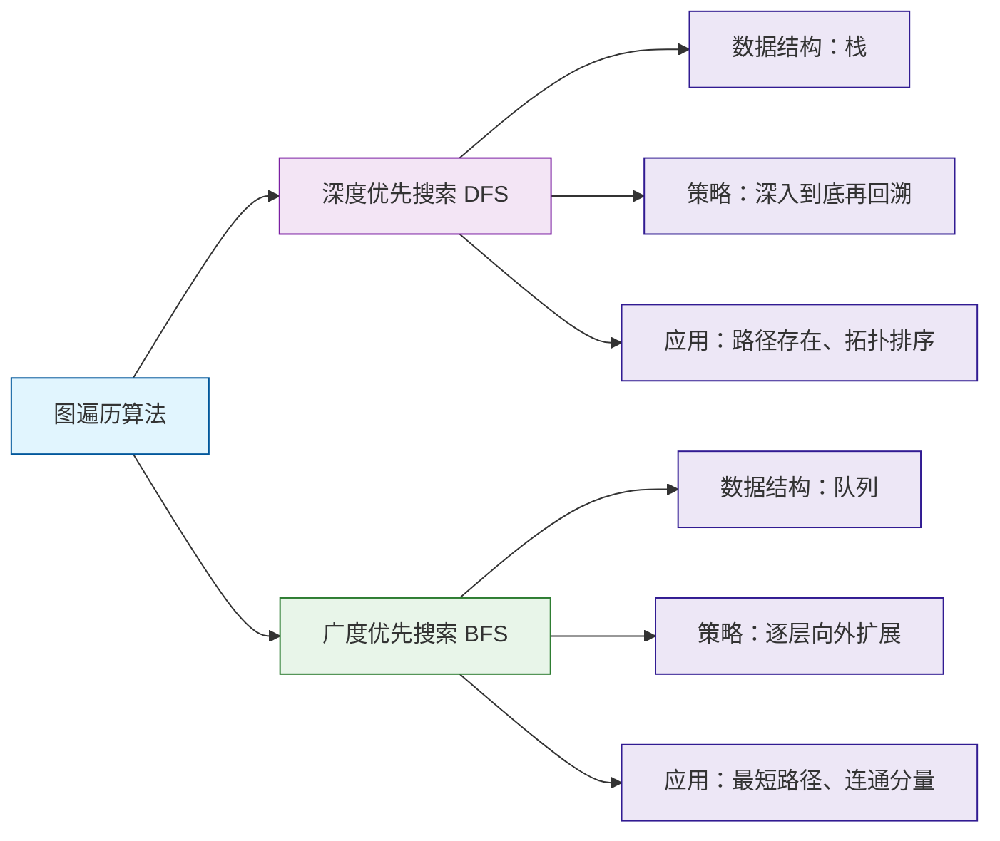

## 算法思想

### 分治算法

分治法（英语：Divide and conquer）是建基于多项分支递归的一种很重要的算法范型，字面上的解释是"分而治之"，就是把一个复杂的问题分成两个或更多的相同或相似的子问题，直到最后子问题可以简单的直接求解，原问题的解即子问题的解的合并。

简单来说，分治就是三个步骤：**分解 -> 解决 -> 合并**。

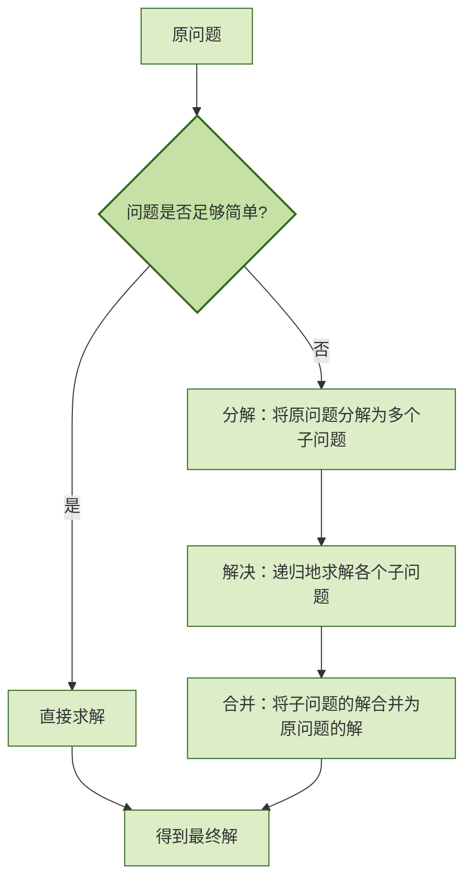


### 贪心算法

贪心算法（英语：greedy algorithm），又称贪婪算法，是一种在每一步选择中都采取在当前状态下最好或最优（即最有利）的选择，从而希望导致结果是全局最好或最优的算法策略。

**贪心算法** 就像我们常说的只顾眼前利益，并不从整体最优上加以考虑，所做的选择只是在某种意义上的局部最优解。

### 动态规划

动态规划（英语：Dynamic programming，简称 DP）通过把原问题分解为相对简单的子问题的方式求解复杂问题的方法。

动态规划的核心是 **记住求过的解** 。

动态规划通常用于解决具有以下性质的问题：

1. **重叠子问题**：在递归求解过程中，同一个子问题会被多次计算。
2. **最优子结构**：一个问题的最优解包含其子问题的最优解。贪心算法也依赖于此，但它在每一步直接选局部最优，而不像 DP 那样会保留所有可能的状态进行推导。

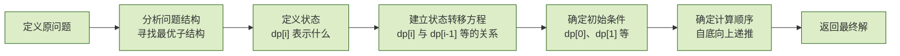

---

### 局部最优的直观理解：找零钱案例

假设你是一名收银员，需要给顾客找 **36元** 零钱，你手头有 **20元、10元、5元、1元** 四种面值的钞票。

- **贪心算法的操作**：
  1. **第一步**：看一眼 36，能给出的最大面值是 **20元**。给出一张。（目前剩余 16元）
  2. **第二步**：看一眼 16，能给出的最大面值是 **10元**。给出一张。（目前剩余 6元）
  3. **第三步**：看一眼 6，能给出的最大面值是 **5元**。给出一张。（目前剩余 1元）
  4. **第四步**：看一眼 1，能给出的最大面值是 **1元**。给出一张。（找零结束）

**结果**：你用了 4 张钞票。在这个过程中，你每一步都在选**当前能拿出的最大面额**。这就是“局部最优”。

------

### 局部最优 vs. 全局最优

贪心算法之所以被叫做“只顾眼前利益”，是因为它**不回溯**。

如果我们将规则稍微改变，贪心就会失效：

- 假设面值变为：**20元、15元、1元**。
- **贪心的选法**：先拿 **20**，剩下的 16元只能拿 16 张 **1元**。总共 **17张**。
- **全局最优（DP）的选法**：我会先拿两张 **15**，剩下的 6元拿 6 张 **1元**。总共 **8张**。

**结论**：贪心算法在第一步选择 **20** 时，确实是“当前状态下最好”的（局部最优），但它没预见到选了 20 会导致后面必须用一堆 1 元凑数。

------

### 贪心与动态规划的底层决策差异

| **特性**       | **贪心算法**                                 | **动态规划 (DP)**                                  |
| -------------- | -------------------------------------------- | -------------------------------------------------- |
| **决策顺序**   | **单向选择**：一旦选定，绝不反悔。           | **全局评估**：考虑所有子问题的重叠和依赖。         |
| **计算方式**   | **当下最好**：仅依赖当前状态做出最优判断。   | **记住过去**：利用已求得的子问题解来推导当前最优。 |
| **最优子结构** | 局部最优解能推导出全局最优解（需数学证明）。 | 全局最优解必须包含子问题的最优解。                 |

---

## 迪杰斯特拉算法

DJ算法(最短路径算法)

动态的比较路径


